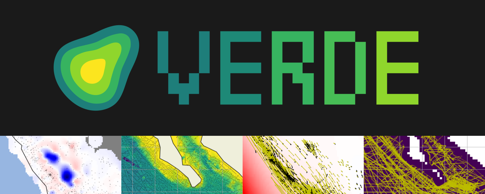

.. title:: Home

========
|banner|
========

.. raw:: html

    

        Processing and gridding spatial data
    

.. seealso::

    Verde is a part of the
    `Fatiando a Terra <https://www.fatiando.org/>`_ project.

.. include:: ../README.rst
    :start-after: placeholder-for-doc-index

.. toctree::
    :maxdepth: 2
    :hidden:
    :caption: Getting Started

    tutorials/overview.rst
    install.rst
    citing.rst
    gallery/index.rst

.. toctree::
    :maxdepth: 2
    :hidden:
    :caption: User Guide

    sample_data/index.rst
    tutorials/grid_coordinates.rst
    tutorials/trends.rst
    tutorials/decimation.rst
    tutorials/projections.rst
    tutorials/chain.rst
    tutorials/model_evaluation.rst
    tutorials/model_selection.rst
    tutorials/weights.rst
    tutorials/vectors.rst

.. toctree::
    :maxdepth: 2
    :hidden:
    :caption: Reference documentation

    api/index.rst
    changes.rst
    references.rst

.. toctree::
    :maxdepth: 2
    :hidden:
    :caption: Community

    Join the community <http://contact.fatiando.org>
    How to contribute <https://github.com/fatiando/verde/blob/master/CONTRIBUTING.md>
    Code of Conduct <https://github.com/fatiando/verde/blob/master/CODE_OF_CONDUCT.md>
    Source code on GitHub <https://github.com/fatiando/verde>
    The Fatiando a Terra project <https://www.fatiando.org>
